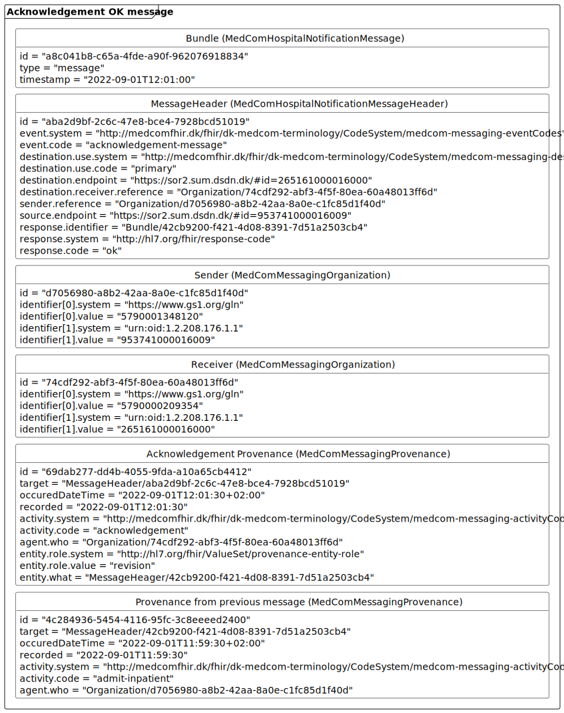
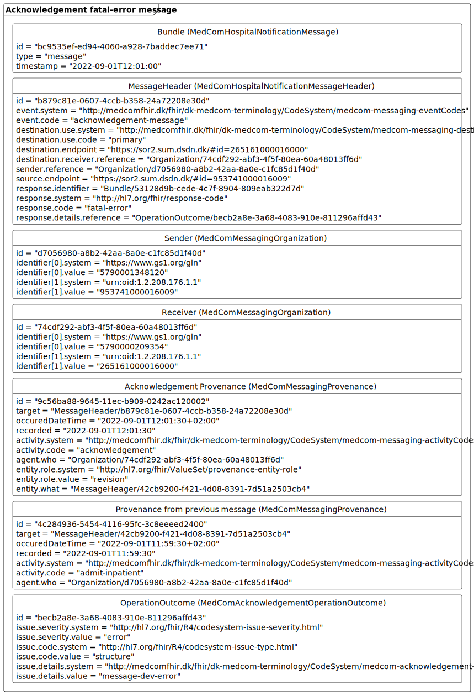
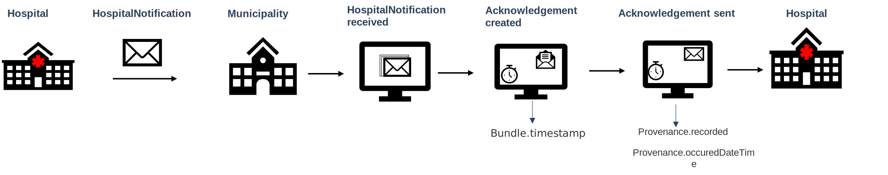

[Return](../../index.md)
# Introduction to the technical specification

 **Table of contents**
* [1 Profiles in the Acknowledgement Standard](#1-profiles-in-the-acknowledgement-standard)
  * [1.1 Codes for detailed error description](#11-codes-for-detailed-error-description)
* [2 General Acknowledgement Messaging Model](#2-general-acknowledgement-messaging-model)
* [3 Example of acknowledgement message](#3-example-of-acknowledgement-message)
* [4 Timestamps for acknowledgement message](#4-timestamps-for-acknowledgement-message)

 > In case of discrepancies between the  <a href="https://medcomfhir.dk/ig/dk-medcom-acknowledgement/" target="_blank">Acknowledgement Implementation Guide(IG)</a> and this page, it is the IG which should be followed. Please contact <fhir@medcom.dk> if you find discrepancies.

# 1 Profiles in the Acknowledgement Standard
The Acknowledgement standard is based on  profiles from, respectively <a href="https://medcomfhir.dk/ig/dk-medcom-acknowledgement/" target="_blank">MedCom Acknowledgement IG</a> <a href="https://medcomfhir.dk/ig/dk-medcom-messaging/" target="_blank">MedCom Messaging IG</a>. A short description of each profile can be seen in the <a href="#Tab1"> Table 1</a>. 

<table class="tg" style="undefined;table-layout: fixed; width: 1281px" id="Tab1">
<caption style="color:#2c415c; font-weight:bold; text-align:center"> Table 1: Overview of the profiles in the Acknowledgement standard</caption>
<colgroup>
<col style="width: 291px">
<col style="width: 115px">
<col style="width: 435px">
<col style="width: 235px">
<col style="width: 205px">
</colgroup>
<thead>
  <tr>
    <th class="tg-sm6y">Profile</th>
    <th class="tg-sm6y">Resource</th>
    <th class="tg-sm6y">Description</th>
    <th class="tg-sm6y">MustSupportelements</th>
    <th class="tg-sm6y">Implementation Guide Origin </th>
  </tr>
</thead>
<tbody>
  <tr>
    <td class="tg-hrrh"><a href="https://medcomfhir.dk/ig/dk-medcom-acknowledgement/StructureDefinition-medcom-messaging-acknowledgement.html" target="_blank">MedComAcknowledgementMessage</a></td>
    <td class="tg-hrrh">Bundle</td>
    <td class="tg-hrrh">Acts as a container for the content of the message. The type of the Bundle shall always be 'message'.  This profile inherits from MedComMessagingMessage.</td>
    <td class="tg-hrrh">Id Type Timestamp  entry (Reference to all included profiles)</td>
    <td class="tg-hrrh">Acknowledgement</td>
  </tr>
  <tr>
    <td class="tg-hrrh"><a href="https://medcomfhir.dk/ig/dk-medcom-acknowledgement/StructureDefinition-medcom-messaging-acknowledgementHeader.html" target="_blank">MedComAcknowledgementMessageHeader</a>    </td>
    <td class="tg-hrrh">MessageHeader</td>
    <td class="tg-hrrh">The header of a message, which shall always be the first referenced profile, when the type of the Bundle is 'message'. This profile holds references to the fundamental information in a message such as sender, receiver, and how the delivery went.  This profile inherits from MedComMessagingMessageHeader.</td>
    <td class="tg-hrrh">Id  EventCoding (Type of message)  Sender Receiver Response identifier (id) Response code</td>
    <td class="tg-hrrh">Acknowledgement</td>
  </tr>
  <tr>
    <td class="tg-hrrh"><a href="https://medcomfhir.d/ig/dk-medcom-acknowledgement/StructureDefinition-medcom-acknowledgement-operationoutcome.html" target="_blank">MedComAcknowledgementOperationOutcome</a>    </td>
    <td class="tg-hrrh">OperationOutcome</td>
    <td class="tg-hrrh">Includes a detailed description of the error and the severity of the error. It shall always be included when an error occurs in the message exchange.</td>
    <td class="tg-hrrh">Id Issue Severity Issue code Details </td>
    <td class="tg-hrrh">Acknowledgement</td>
  </tr>
  <tr>
    <td class="tg-hrrh"><a href="https://medcomfhir.dk/ig/dk-medcom-messaging/StructureDefinition-medcom-messaging-organization.html" target="_blank">MedComMessagingOrganization</a>  </td>
    <td class="tg-hrrh">Organization</td>
    <td class="tg-hrrh">Inherits from MedComCoreOrganization  Information useful to identify an organization. In a Acknowledgement message it is used to describe the sender and receiver organizations. </td>
    <td class="tg-hrrh">Id Slices for identifier (SOR-id) Slices for identifier (EAN/GLN-id) Name</td>
    <td class="tg-hrrh">Messaging</td>
  </tr>
  <tr>
    <td class="tg-hrrh"><a href="https://medcomfhir.dk/ig/dk-medcom-messaging/StructureDefinition-medcom-messaging-provenance.html" target="_blank">MedComMessagingProvenance</a></td>
    <td class="tg-hrrh">Provenance</td>
    <td class="tg-hrrh">Describes the activity and references the message that is acknowledged.</td>
    <td class="tg-hrrh">Id Target OccurredDateTime  Timestamps Activity Agent Entity (Reference to the previous message)</td>
    <td class="tg-hrrh">Messaging</td>
  </tr>
</tbody>
</table>

>Note:The Acknowledgement standard is inherited from MedCom Messaging.Therefore a detailed description of the MustSupport elements can be found on the <a href="https://medcomdk.github.io/dk-medcom-messaging/assets/documents/Intro-Technical-Spec-ENG.html" target="_blank">technical content of MedCom Messaging.</a>  

## 1.1 Codes for detailed error description

The ValueSet and CodeSystem used for detailed error description, in the element OperationOutCome.issue.details.coding, are currently fairly empty, as MedCom wants input from IT-vendors on which codes give values in their systems. Across sectors there must be an agreed list of codes. Therefore, the ValueSet and CodeSystem has a status as ‘draft’ and vendors should expect the CodeSystem and ValueSet to be extended.

# 2 General Acknowledgement Messaging Model
<a href="#Fig1"> Figure 1</a> illustrates the structure of the Acknowledgement message. The Acknowledgement message follows <a href="https://medcomdk.github.io/dk-medcom-messaging/assets/documents/Intro-Technical-Spec-ENG.html" target="_blank">MedCom's FHIR messaging model</a> except  the carbon-copy destination, which is not allowed. 

<figure>

<figcaption text-align="center"><b>Figure 1: Structure of the Acknowledgement message </b> </figcaption>
</figure>

# 3 Example of Acknowledgement message
The Acknowledgement message can have three different outcomes: one positive (Ok), and two negative, resp ectively transient-error and fatal-error. An example of an Ok Acknowledgement message is shown in <a href="#Fig2"> Figure 2</a>, wherease an example of an erro Acknowledgement message is shown in <a href="#Fig3"> Figure 3</a>.
<figure>

<figcaption text-align="center"><b>Figure 2: Simplified example:OK Acknowledgement message </b> </figcaption>
</figure>

<figure>

<figcaption text-align="center"><b>Figure 3: Simplified example:Fatal-Error Acknowledgement message </b> </figcaption>
</figure>

# 4 Timestamps for Acknowledgement message
The acknowledgement message contains three timestamps:

* Bundle.timestamp
* Provenance.occuredDateTime[x]
* Provenance.recorded.

The three timestamps are registered at different time during Acknowledgement message generation and sending. The Acknowledgement message is sent when a system receives a FHIR message e.g. when a municipality receives a HospitalNotification message from the hospital, the it-system will evaluate the message. Based on the result from the evaluation, the system will generate an acknowlegement message that represet the evaluation results. This means that if the HospitalNotification is evaluated positive the acknowlegdement is as well positive. Whereas if the HospitalNotification is evaluated negative then a negative Acknowledgement is generated and send. When the acknowledgement message is generated a Bundle.timestamp is registered. When the acknowledgement message is sent the Provenance.occuredDateTime[x] and Provenance.recorded time stamp is registered. Note that the Provenance.occuredDateTime[x] is a human redable, where Provenance.recorded is a system readable. The visualisation of the example can be seen in <a href="#Fig4"> Figure 4</a> 

<figure>

<figcaption text-align="center"><b>Figure 4: Example of timestamps registration for Acknowledgement message  </b> </figcaption>
</figure>